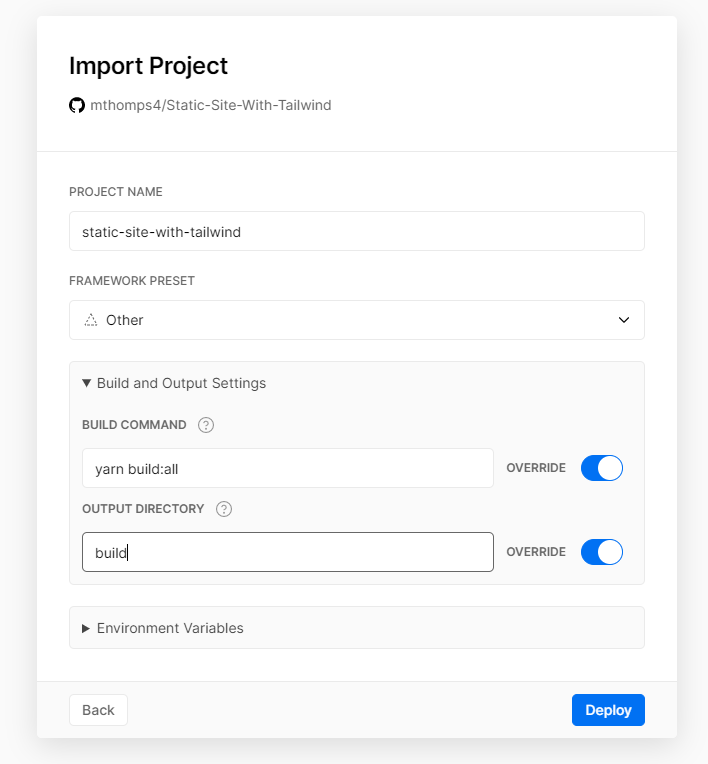
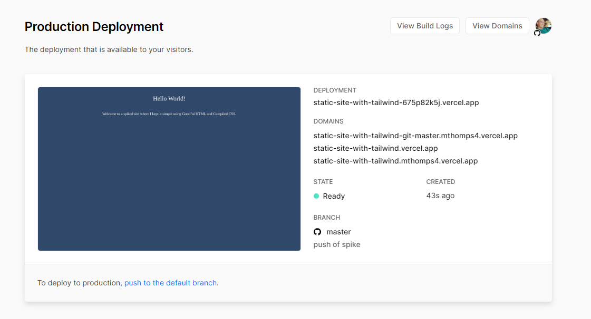

# Static Site (w/ Tailwind)

## The Stack
- [HTML](https://developer.mozilla.org/en-US/docs/Web/HTML)
- [Tailwindcss](https://tailwindcss.com/docs/installation/)

## How to run
### DEV
- Run `yarn serve:dev` This will _serve_ `src` with `index.html` as your entry point.

- In a second terminal run `yarn watch`. This will watch all files inside of `src/` and know to recompile `app.css` with any new tailwind styles that have been added along the way.

> _Note:_ there's a bit of a delay here before you go hit refresh... "Hey, this ain't no fancy React app K.I.S.S and just hit the refresh button."

- To compiling Tailwind CSS manually for `dev` without watching run `yarn compile:css:dev`

### Building for Production
So you actually want to deploy this thing...
- Run `yarn build:all` to do "all the things"
  This will copy over all the `*.html` files to a `/build` directory and compile `app.css` with the `NODE_ENV=production`. This tells Tailwind to use our preset `purge` option from [tailwind.config.js](./tailwind.config.js)

- Copy this `/build` directory to any static hosting site... Or tell your static hosting site to use `/build/index.html` as it's entry point.

> _Note:_ After building you may serve this build locally as well to see what "prod" will look like by running `yarn serve:prod`. This will serve up the `build` directory instead of `src` for viewing with the newly compiled code.

### That's it
That is it folks... Drop in some static HTML, link `index.css`, and have fun.

### Hosting with [Vercel](vercel.com)
Linking the Repo and Settings

Preview of Deploy

Done!